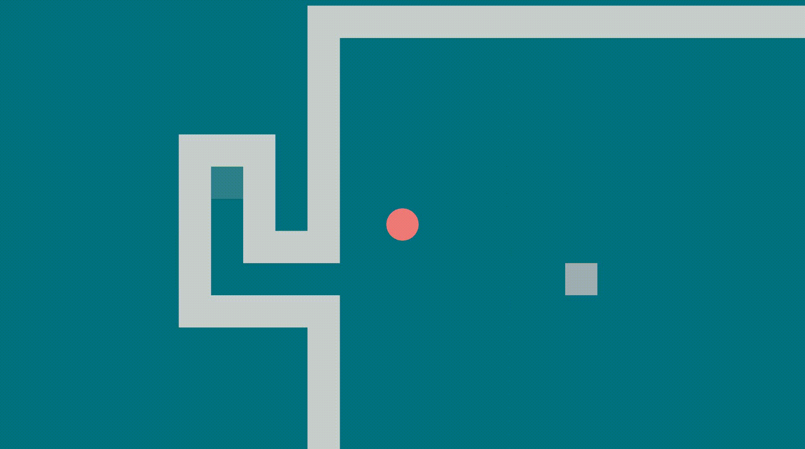

# Ruga

a game made in rust

it is in early development.

## Install

*links to downloads*

## Play

move:
 * `w`,`a`,`s`,`d` keys
 * `↑`,`←`,`↓`,`→` keys
 * joystick axis and DPad

goto menu:
 * `Escape` key
 * `Select` button

## Build from sources

install rust environment using [standard download](https://www.rust-lang.org/en-US/downloads.html) or [rustup.rs](https://rustup.rs/)

compile the project: `cargo build --release`

run: `./target/release/ruga`

be careful it must be run at the root of the ruga directory in order to access to assets and configuration files.

## Modding

[**config.toml**](config.toml) holds constant that can be modified on the fly

[**levels**](levels) directory holds castles definition, to add a castle just create a directory with **(take example on the official castle)** :
* config.toml `file`
  * music `string`: name of the sond to play in the corridor
  * dungeons `array`:
    * name `string`: name of the dungeon
    * music `string`: name of the music to play in the dungeon
    * rooms `array`: array of names of texts or maps
* music `directory`
  * musics in ogg format and in 44100Hz
* maps `directory`
  * png image, each color define an object, see maps in official maps
* texts `directory`
  * texts for text rooms

## Licenses

### Code

Copyright (C) 2016 thiolliere

This program is free software: you can redistribute it and/or modify
it under the terms of the GNU General Public License as published by
the Free Software Foundation, either version 3 of the License, or
(at your option) any later version.

This program is distributed in the hope that it will be useful,
but WITHOUT ANY WARRANTY; without even the implied warranty of
MERCHANTABILITY or FITNESS FOR A PARTICULAR PURPOSE.  See the
GNU General Public License for more details.

You should have received a copy of the GNU General Public License
along with this program.  If not, see <http://www.gnu.org/licenses/>.

### Sounds FX

all sounds comes from Xonotic and so are GPLv2 compatible

### Musics

None yet but maybe CC-BY and CC-BY-SA
